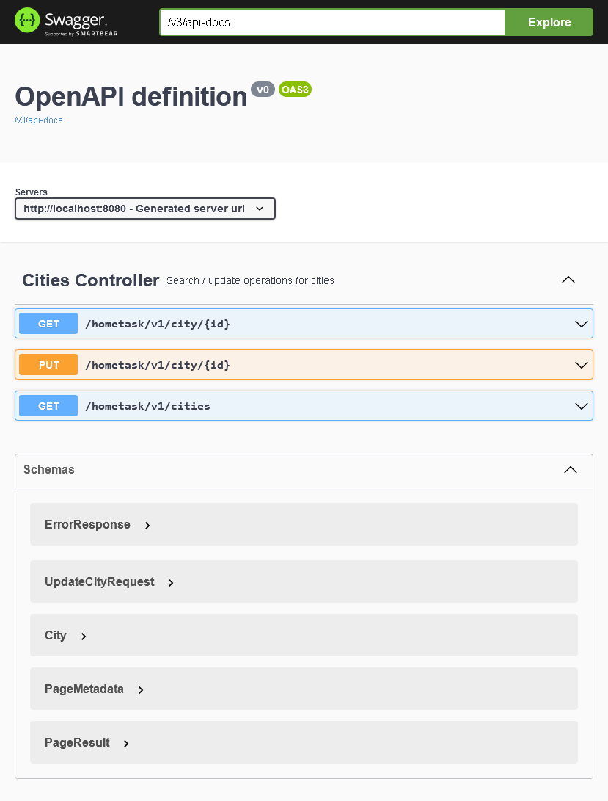

### REST API Demo Project

#### Building
This is maven java 11 project. Use following command to build demo application:  
`mvn clean package` from root directory.
#### Launching application
`java -jar target/demo-0.0.1-SNAPSHOT.jar`

#### Accessing REST endpoints
The most convenient way is to use Swagger (OpenApi), it provides easy and intuitive usage. 
After application starts, go to `localhost:8080/swagger-ui/index.html` page, it looks like

OpenApi docs available at `http://localhost:8080/v3/api-docs`, may be used with Postman or other tools.

#### Accessing in-memory H2 database
Database console is available at `http://localhost:8080/h2-console/`.
JDBC url is `jdbc:h2:mem:db`

#### Technical stack used
- Java 11
- Maven
- Spring Boot, Spring Data
- JPA/Hibernate
- In-memory H2 database
- Liquibase
- OpenApi (Swagger)

This is Back-End only implementation.

